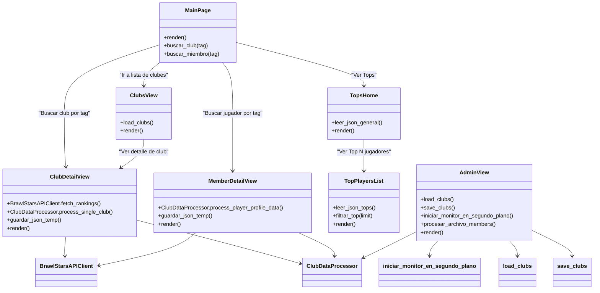

# LA Spain - Proyecto Brawl Stars

## Descripción General

**LA Spain** es una plataforma web desarrollada en Django para mostrar información detallada sobre clubes y jugadores de Brawl Stars de la región de España, incluyendo rankings y estadísticas de redes sociales. La aplicación consume datos desde APIs externas y JSON locales.

---

## Características Principales

* Visualización de información de clubes (`laclubs.html`).
* Consulta de detalles de un club o jugador mediante tag.
* Página de Tops (`tops_home.html`) con botones para ver Top 10, 50, 100, 250 y 500 jugadores.
* Dashboard de administración para agregar, editar, eliminar clubes y subir archivos `members.json`.
* Monitoreo y actualización de datos en segundo plano mediante `iniciar_monitor_en_segundo_plano`.
* Lluvia animada en la interfaz para escritorio (desactivada en móviles).

---

## Navegación y Dependencias entre Vistas

### 1. Main Page (`main_page.html`)

* Puntos de entrada:
  * Ver lista de clubes → `clubs_view`
  * Buscar club por tag → `club_detail_view`
  * Buscar jugador por tag → `member_detail_view`
  * Tops → `tops_home`

### 2. Clubs View (`laclubs.html`)

* Mostrar lista de clubes y última actualización.
* Acceso a:
  * Detalle de club → `club_detail_view`

### 3. Club Detail (`club_detail.html`)

* Procesos:
  * Llamada API a `BrawlStarsAPIClient` y procesamiento con `ClubDataProcessor`.
  * Guardado temporal en `data/temp/club.json`.
* Dependencias:
  * Retorna error si tag no existe o archivo JSON temporal no encontrado.

### 4. Member Detail (`member_detail.html`)

* Procesos:
  * Llamada API a `BrawlStarsAPIClient` y procesamiento con `ClubDataProcessor`.
  * Guardado temporal en `data/temp/profile.json`.
* Dependencias:
  * Retorna error si tag no existe o archivo JSON temporal no encontrado.

### 5. Tops Home (`tops_home.html`)

* Muestra estadísticas generales de clubes (`lageneral.json`).
* Acceso a:
  * Listado de Top jugadores → `top_players_list`

### 6. Top Players List (`top_players_list.html`)

* Lectura de `tops.json`.
* Filtrado según límite (`10`, `50`, `100`, `250`, `500`).

### 7. Admin View (`admin_panel.html`)

* Requiere login.
* Funcionalidades:
  * Agregar, editar, eliminar clubes.
  * Recargar datos con `iniciar_monitor_en_segundo_plano`.
  * Subir archivo `members.json` para actualizar datos de miembros.
* Validaciones:
  * Archivo JSON correcto.
  * Tags únicos.

---

## Procesos Internos y Llamadas a Funciones



---

## Estructura de Archivos

```

WebLA
│
├── brawl_job
│   ├── data
│   │   ├── clubs/
│   │   │   └── laclubs.json
│   │   ├── members/
│   │   │   └── tops.json
│   │   ├── social_media/
│   │   │   └── lageneral.json
│   │   ├── temp/
│   │   │   ├── club.json
│   │   │   └── profile.json
│   │   ├── clubs_list.json
│   │   └── last_update.json
│   │
│   ├── data_fetcher
│   │   ├── api_client.py
│   │   ├── config.py
│   │   ├── data_processor.py
│   │   ├── models.py
│   │   ├── utils.py
│   │
│   └── main.py
│
├── clubs
│   ├── migrations/
│   ├── templates
│   │   └── clubs
│   │       ├── admin_panel.html
│   │       ├── club_detail.html
│   │       ├── laclubs.html
│   │       ├── login.html
│   │       ├── main_page.html
│   │       ├── member_detail.html
│   │       ├── top_players_list.html
│   │       └── tops_home.html
│   │
│   ├── __init__.py
│   ├── admin.py
│   ├── apps.py
│   ├── models.py
│   ├── tests.py
│   ├── urls.py
│   └── views.py
│
├── config/
│   ├── __init__.py
│   ├── asgi.py
│   ├── settings.py
│   ├── urls.py
│   └── wsgi.py
│
├── manage.py
└── readme.MD

```

---

## Requisitos

* Python >= 3.10
* Django >= 4.2
* Dependencias adicionales:
  * requests
  * humanize (para formateo de números)
  * json
  * pathlib
  * "requirements.txt"

---

## Tecnologías Utilizadas

* Backend: Django
*Frontend: HTML5, CSS3, JavaScript
* Base de Datos: JSON (sustituible por MySQL3)
* APIs: Integración con APIs externas:
  * [Brawl Stars API oficial](https://developer.brawlstars.com/#)
  * [API Brawl Stars no oficial](https://api.rnt.dev/docs)

---

## Instalación

```bash
git clone <repo_url>
cd la_spain
python -m venv venv
source venv/bin/activate  # Linux/Mac
venv\Scripts\activate     # Windows
pip install -r requirements.txt
python manage.py migrate
python manage.py runserver
```

---

## Uso

1. Acceder a la main page (`/`).
2. Navegar a clubes, tops o buscar jugador/club por tag.
3. Cuadro de texto con la historia de la organización.
4. Para administración:
   * Login como administrador (`/login/`).
   * Agregar/editar/eliminar clubes.
   * Comprobar disponibilidad de la API
   * Recargar datos.

---

## Consideraciones

* Archivos temporales (`data/temp/*.json`) se generan tras consultar club o miembro.
* La lluvia animada en la interfaz está desactivada en pantallas ≤1125px.
* Validaciones estrictas para tags duplicados y archivos JSON inválidos.
* Última actualización (`last_update.json`) se muestra en todas las páginas.

---

## Autor

- **Desarrollador:** [Vimen](https://vimen1803.github.io/VictorMenjonPortfolio)
- **Contacto:** 📧 [victormnjfan@gmail.com](https://mail.google.com/mail/?view=cm&fs=1&to=victormnjfan@gmail.com)  
- **Año:** 2025  
- **Derechos reservados:** © LA Spain
