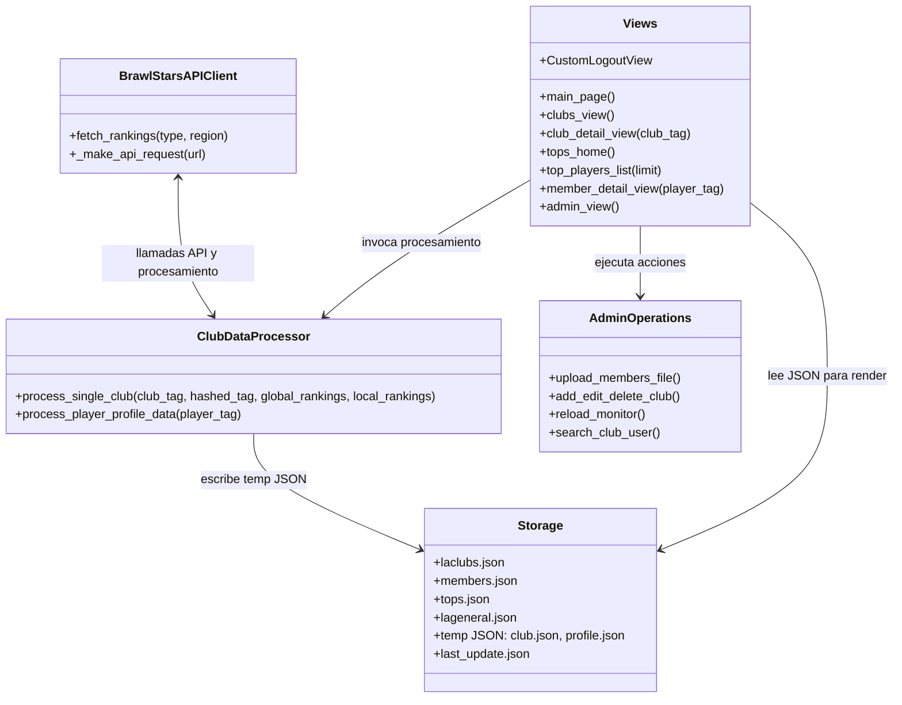
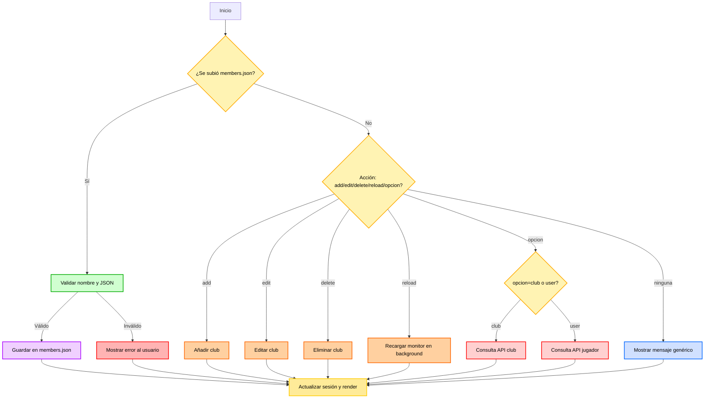

# WebLA
Página web diseñada con Django para la gestión de clubs de una comunidad de Brawl Stars. Cuenta con vista de miembros y clubs singulares, también externos a la comunidad. Panel de administración para controlar los clubs de la comunidad e incluso una consola para comprobar el funcionamiento de la API.

# LA Spain - Documentación Técnica Completa

## Flujo de Navegación y Procesamiento Interno

```mermaid
flowchart TD
    %% ----------------------
    %% Main Page
    %% ----------------------
    A[Main Page]:::page -->|Buscar Club| B[Club Detail View]:::page
    A -->|Buscar Jugador| C[Member Detail View]:::page
    A --> D[Tops Home]:::page
    D --> E[Top Players List 10/50/100/250/500]:::page
    B -->|Ver Miembros| C
    C -->|Volver| A
    E -->|Volver| D

    %% ----------------------
    %% Backend y Llamadas
    %% ----------------------
    subgraph API Layer
        API1[BrawlStarsAPIClient.fetch_rankings(tipo, region)]:::api
        API2[BrawlStarsAPIClient._make_api_request(url)]:::api
    end

    subgraph Processor Layer
        P1[ClubDataProcessor.process_single_club(club_tag, hashed_tag, global_rankings, local_rankings)]:::proc
        P2[ClubDataProcessor.process_player_profile_data(player_tag)]:::proc
    end

    subgraph Storage
        S1[laclubs.json]:::storage
        S2[members.json]:::storage
        S3[tops.json]:::storage
        S4[lageneral.json]:::storage
        S5[Temp: club.json, profile.json]:::storage
        S6[last_update.json]:::storage
    end

    subgraph Admin Panel
        AP1[Subida de members.json]:::admin
        AP2[Añadir/Editar/Eliminar Club]:::admin
        AP3[Recarga de Monitor]:::admin
        AP4[Consulta API Club/Usuario]:::admin
    end

    subgraph Views
        V1[main_page.html]:::view
        V2[laclubs.html]:::view
        V3[tops_home.html]:::view
        V4[top_players_list.html]:::view
        V5[club_detail.html]:::view
        V6[member_detail.html]:::view
        V7[admin_panel.html]:::view
    end

    %% ----------------------
    %% Conexiones de Navegación
    %% ----------------------
    V1 -->|Request Club/Player| API2
    V1 -->|Render| V1

    V2 -->|Leer JSON| S1
    V2 -->|Render| V2

    V3 -->|Leer JSON| S4 & S6
    V3 -->|Render| V3

    V4 -->|Leer Tops JSON| S3 & S6
    V4 -->|Render| V4

    V5 -->|Request Club Data| API1 & P1
    P1 --> S5
    S5 --> V5

    V6 -->|Request Player Data| API2 & P2
    P2 --> S5
    S5 --> V6

    V7 -->|Admin Operations| AP1 & AP2 & AP3 & AP4
    AP1 --> S2 & S5
    AP2 --> S1
    AP3 --> API1 & API2 & P1 & P2
    AP4 --> API2 & P2
    V7 -->|Render| V7

    %% ----------------------
    %% Estilos
    %% ----------------------
    classDef page fill:#ffeb99,stroke:#ffcc00,stroke-width:2px,color:#000;
    classDef view fill:#d0f0fd,stroke:#00aaff,stroke-width:2px,color:#000;
    classDef api fill:#ffd0d0,stroke:#ff0000,stroke-width:2px,color:#000;
    classDef proc fill:#d0ffd0,stroke:#00aa00,stroke-width:2px,color:#000;
    classDef storage fill:#f0d0ff,stroke:#aa00ff,stroke-width:2px,color:#000;
    classDef admin fill:#ffd0a0,stroke:#ff6600,stroke-width:2px,color:#000;
```

---

## Detalle de Clases y Funciones



---

## Flujo de Admin Panel Detallado



---

## Estructura de Archivos

```
brawl_job/
├─ data/
│  ├─ clubs/
│  │  ├─ laclubs.json
│  │  └─ clubs_list.json
│  ├─ members/
│  │  ├─ members.json
│  │  └─ tops.json
│  └─ social_media/
│     └─ lageneral.json
├─ main.py
├─ data_fetcher/
│  ├─ api_client.py
│  ├─ config.py
│  └─ data_processor.py
├─ templates/
│  └─ clubs/
│     ├─ main_page.html
│     ├─ laclubs.html
│     ├─ tops_home.html
│     ├─ top_players_list.html
│     ├─ club_detail.html
│     ├─ member_detail.html
│     └─ admin_panel.html
├─ views.py
└─ urls.py
```

---

## Funcionalidades Principales

- Navegación: Main Page → Club / Player / Tops  
- Club Detail: Información completa + miembros  
- Member Detail: Perfil completo de jugador  
- Tops Home: Rankings Top 10/50/100/250/500  
- Admin Panel: Gestión de clubes, carga JSON, recarga monitor, consultas API  
- Manejo de errores y condicionales completo  
- Animaciones y mejoras visuales para UX

---

## Instalación

```bash
git clone <repo_url>
cd la-spain
python -m venv venv
source venv/bin/activate   # Linux/macOS
venv\Scripts\activate      # Windows
pip install -r requirements.txt
python manage.py runserver
```

Acceder en: `http://127.0.0.1:8000/`

---

## Licencia

Privado, propiedad de LA Spain © 2025
